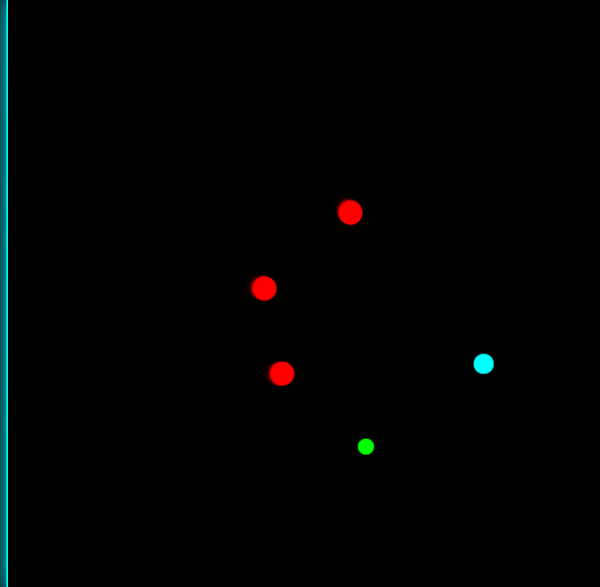
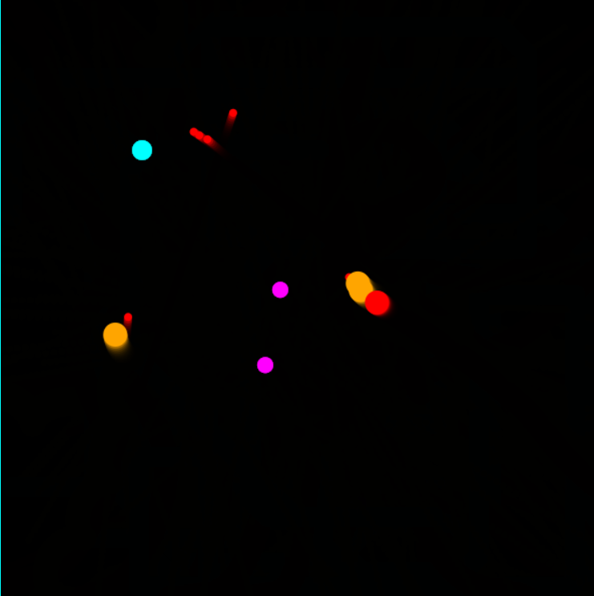

# ⚡ NEON BARRAGE

> **A fast-paced neon survival shooter built with pure JavaScript and HTML5 Canvas**

**Neon Barrage** is a top-down arcade shooter where survival is the only goal.  
Enemies spawn in increasingly dangerous waves, new behaviors unlock over time, and quick reflexes are your only defense in a glowing cyber arena.

This game is built **from scratch** using only core web technologies — no frameworks, no libraries, no game engines.

---

## 🖼️ Gameplay Screenshots

  
  

> Real gameplay screenshots showcasing waves, enemies, power-ups, and UI.

## 🕹️ Game Features

### ⚔️ Combat
- Mouse-aimed shooting
- Continuous firing with cooldown control
- Enemy projectiles in later waves

### 🧠 Enemy AI
- **Normal Enemies** – direct pursuit behavior
- **Zig-Zag Enemies** – unpredictable movement patterns
- Gradual difficulty scaling per wave

### 🌊 Wave System
- Structured wave progression
- Increasing enemy count and speed
- Enemy abilities unlocked at higher waves

### ⚡ Power-Ups
- 💚 **Heal** – restores player health
- ⚡ **Rapid Fire** – reduced shooting cooldown
- 🔱 **Spread Shot** – multi-directional bullets

### ❤️ Player Systems
- Health bar UI
- Damage feedback
- Smooth boundary-safe movement

### 🔊 Sound Design
- Procedural sound effects using **Web Audio API**
- Shooting, hit, and damage feedback sounds
- No external audio assets used

### 🏆 Score & Progress
- Score increases per enemy kill
- Wave tracking system
- **Persistent high-score storage** using `localStorage`

### ⏸️ Game States
- Play / Pause
- Info screen
- Game Over overlay
- Restart support

---

## 🎮 Controls

| Action | Input |
|------|------|
| Move | Arrow Keys |
| Shoot | Mouse Click / Space |
| Pause | `P` |
| Info | `I` |
| Restart | `R` |

---

## 🛠️ Tech Stack

- **HTML5 Canvas**
- **Vanilla JavaScript (ES6)**
- **CSS (Neon UI)**
- **Web Audio API**
- **LocalStorage**

> Built without any external libraries or frameworks.

---

## 🧠 What This Project Demonstrates

- Game loop and real-time rendering
- Collision detection (circle-based)
- Enemy AI behavior design
- Wave-based difficulty scaling
- State management (PLAYING / PAUSED / INFO / GAME_OVER)
- UI and gameplay separation
- Procedural audio generation
- Persistent data storage

This project was developed **step-by-step**, focusing on clarity, scalability, and strong fundamentals.

---

## 👤 Author

**Raman Duggal**

ID->RD1241

BCA(AI/ML) Student

🎯 AI / ML Engineer (Primary)  
🎮 Software & Game Developer  
📊 Data Analyst (Visualization + BI)

> Part of a long-term journey toward building intelligent and interactive systems.
